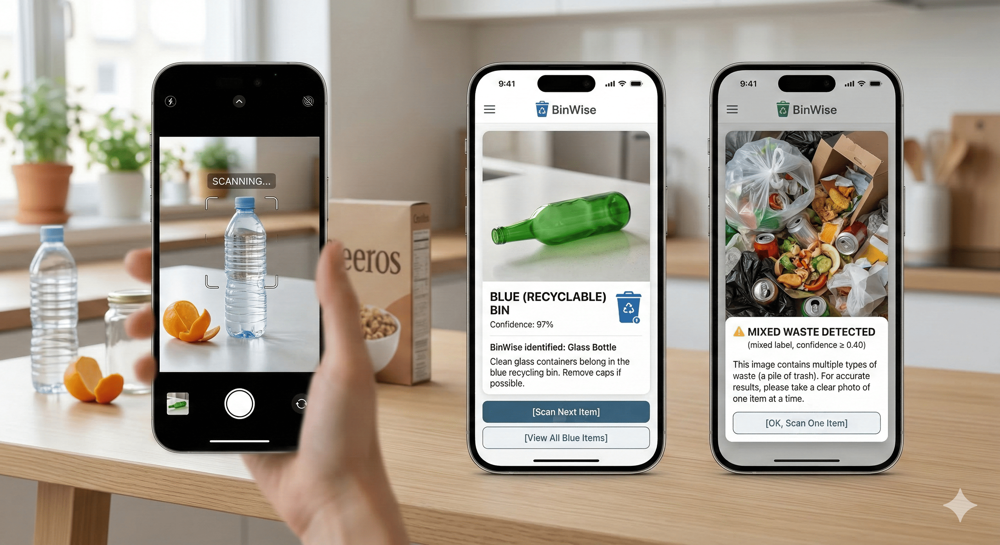

# BinWise AI Service

<p align="center">
  
</p>

A backend service that looks at a photo of a waste item and tells you which bin it belongs in. Point it at an image, and it'll come back with a bin colour, a category, and a short explanation of why.

Built with Django, CLIP (zero-shot image classification), and Django REST Framework. No training required — it works straight out of the box.

---

## How it works

BinWise uses **OpenAI's CLIP model** (`clip-vit-base-patch32`) to classify waste images. Instead of training a custom model, we use **prompt ensembling** — each waste category has 4–6 carefully written text descriptions that get averaged into a single strong embedding. The image is then compared against all category embeddings using cosine similarity, and the closest match wins.

It can also detect when multiple waste items are in one photo and ask the user to photograph one item at a time.

---

## What's inside

| File | What it does |
|------|--------------|
| `backend/model.py` | Loads CLIP and handles classification logic with prompt ensembling |
| `backend/waste_rules.py` | Lookup table mapping waste items to bins and guidance |
| `api/views.py` | Django REST Framework views — wires CLIP into the API |
| `api/urls.py` | API route definitions |
| `api/models.py` | WasteItem database model for logging classifications |
| `binwise_project/urls.py` | Main URL config |

---

## Getting started

You'll need Python 3.11. If you're setting up from scratch:

```bash
python3.11 -m venv venv311
source venv311/bin/activate
pip install --upgrade pip
pip install -r requirements.txt
```

Run the database migrations:

```bash
python manage.py migrate
```

Then start the server:

```bash
source venv311/bin/activate
python manage.py runserver
```

It'll be running at `http://127.0.0.1:8000`.

> The first request takes a few seconds while CLIP loads into memory. After that it's fast.

---

## API endpoints

### `POST /api/classify`

Send an image as `multipart/form-data` with the key `image`.

```bash
curl -X POST -F "image=@photo.jpg" http://127.0.0.1:8000/api/classify
```

**Successful classification:**

```json
{
  "bin": "blue",
  "category": "recyclable",
  "explanation": "Clean plastic bottles can be melted into new products.",
  "label": "plastic bottle",
  "confidence": 0.92
}
```

**Multiple items detected:**

```json
{
  "bin": "multiple",
  "category": "multiple_items",
  "explanation": "It looks like there are multiple waste items in this photo. Please photograph one item at a time for an accurate result.",
  "label": "mixed waste",
  "confidence": 0.74
}
```

**Low confidence — returns suggestions:**

```json
{
  "bin": "gray",
  "category": "unclear",
  "explanation": "Not confident enough. Here are the most likely matches.",
  "label": "cardboard box",
  "confidence": 0.18,
  "suggestions": [
    { "label": "cardboard box", "bin": "blue", "category": "recyclable", "confidence": 0.18 },
    { "label": "general waste", "bin": "black", "category": "general waste", "confidence": 0.14 }
  ]
}
```

### `GET /api/health`

Returns `{ "status": "ok" }` if the server is running.

---

## Bin colours

| Colour | Meaning |
|--------|---------|
| `blue` | Recyclable |
| `green` | Organic / compostable |
| `black` | General waste |
| `specialist` | Hazardous — needs special disposal |
| `gray` | Unclear — check local guidelines |
| `multiple` | Multiple items detected — photograph one at a time |

---

## Tweaking things

- **Confidence threshold** — change `CONFIDENCE_THRESHOLD` in `backend/model.py` (default `0.12`)
- **Mixed waste threshold** — change `MIXED_WASTE_THRESHOLD` (default `0.40`) — how confident CLIP needs to be before reporting multiple items
- **Text prompts** — update the `PROMPTS` dict in `backend/model.py` to improve accuracy for specific categories
- **Waste rules** — extend `RULES` in `backend/waste_rules.py` to add new item types
